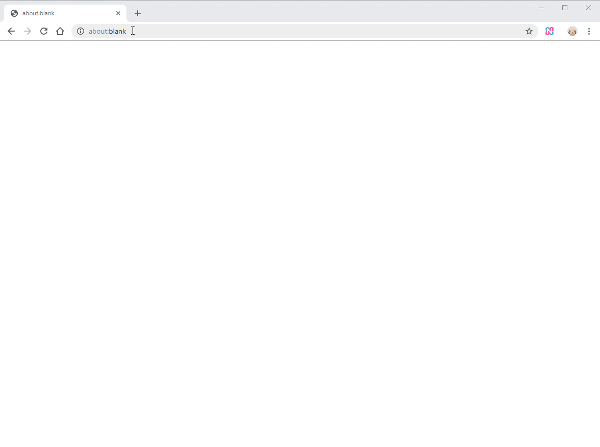
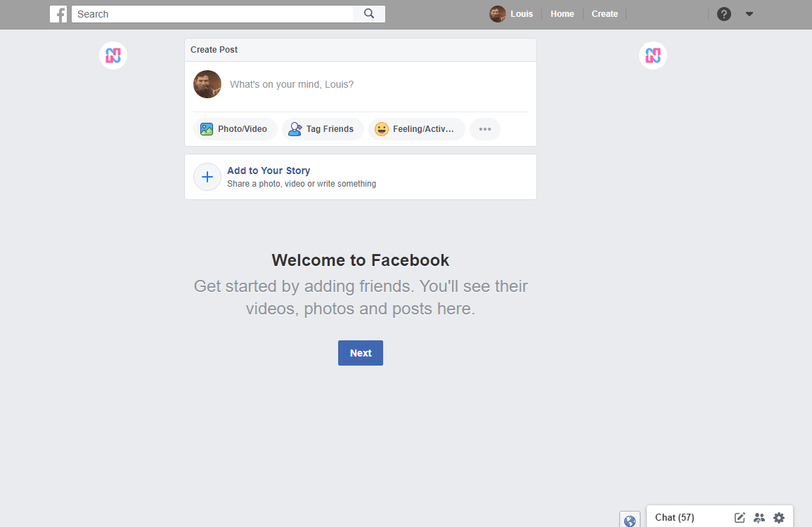
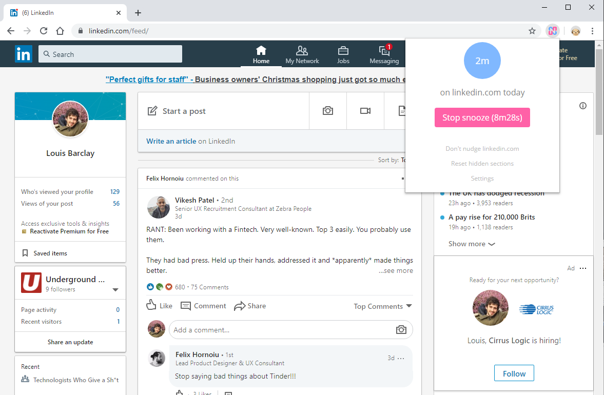

Nudge makes the internet less addictive.

- Hacks websites to make them less persuasive
- Shows you when you're getting sucked in
- Gets rid of some of the most addictive parts of the internet

You can choose which parts of Nudge you want enabled.

[Download Nudge for Google Chrome (4.7 stars)](https://bit.ly/2q7VE0K), or read about Nudge's features below.

# 🚷 Defaulter

*Addictive sites can only be reached by dragging across a slider*

The Defaulter turns addictive sites off by default, so that you don't visit a site mindlessly.

When you try to visit, you are instead shown the Nudge off page, with an image and a slider (see screenshot below).

To visit the site, you have to drag the slider across. The slider gets harder to drag across the more you do it in a given day.

⚙️ You can: choose the sites the Defaulter works on; turn off the setting which makes the slider harder to drag across; switch off the Defaulter entirely.

💎 Bonus: the off page image changes every day so you don't get bored.

# 🌒 Hider

*Hides addictive sections of websites*

The Hider replaces addictive sections of websites with the Nudge logo.

It's like ad blocking, except for things like YouTube recommended videos that are designed to keep you on the site for longer.

⚙️ You can: choose to always show any sections of websites that you need; switch off the Hider completely.

💎 Bonus: email me on louis [at] nudgeware [dot] io if you have a suggestion of a section you'd like hidden. I hope to soon let you add your own hidden sections in Nudge's Settings.

# 👋 Unfollower

*Deletes your Facebook News Feed across all devices*

The Unfollower unfollows every person, page, and group in your Facebook News Feed.

This effectively deletes your News Feed forever across all devices, and even makes Facebook ads disappear.

It's a step up from tools like News Feed Eradicator (which simply hides your News Feed in a given browser) because it's making a fundamental change to Facebook's information about who you're following, meaning your News Feed really is gone forever across all devices.

This is what a blank News Feed looks like:

⚙️ You can: enable an option called 'Auto-unfollow' which will keep you unfollowed forever, in case you add new friends or join new groups; switch off the Unfollower completely.

💎 Bonus: some people like to use this feature to take their News Feed down to zero so they can then consciously refollow people they actually want to be following.

⚠️ Warning: if you use the Unfollower, there is no automated way to refollow everyone and everything. However, you can do this manually in Facebook's News Feed Preferences.

# ⏱ Time Nudger

*Shows you how long you spend on addictive sites*

The Time Nudger is a blue circle that grows (and becomes pink) the longer you spend on an addictive site.

It helps you see when you're getting sucked in, without disrupting you too much. You can still continue using the site while the Time Nudger grows.

⚙️ You can: choose the sites the Time Nudger works on; hide the Time Nudger at any point if it's nudging you a little too much; switch off the Time Nudger completely.

💎 Bonus: clicking the Time Nudger's first button will close the current tab and any other tabs of that domain that you have open. Sort of like a nuclear option to get you back on track.

# 🧻 Scroll Nudger

*Shows you when you're infinitely scrolling*

The Scroll Nudger is a subtle notification that appears in the middle of your window every time you scroll down ten screens' worth.

It helps you see when you're on an infinite scroll binge, without disrupting you too much. You can still continue using the site after the Scroll Nudger appears.

⚙️ You can: choose the sites the Scroll Nudger works on; switch off the Scroll Nudger completely.

# 💤 Snoozer

*Lets you switch off Nudge when you need to*

The Snoozer is a button that turns off all of Nudge's features for 10 minutes.

It's for situations where you need a break; maybe because you need to get into a site for work, or because you're feeling like you don't need to be nudged just then.

⚙️ You can: turn the Snoozer off early after you've done whatever you needed to do.

# Other Features

- 🌼 Add Whitelist sites that you don't ever want to nudge
- ✂️ Remove Facebook's notifications
- ☁️ Make Facebook's top bar grey
